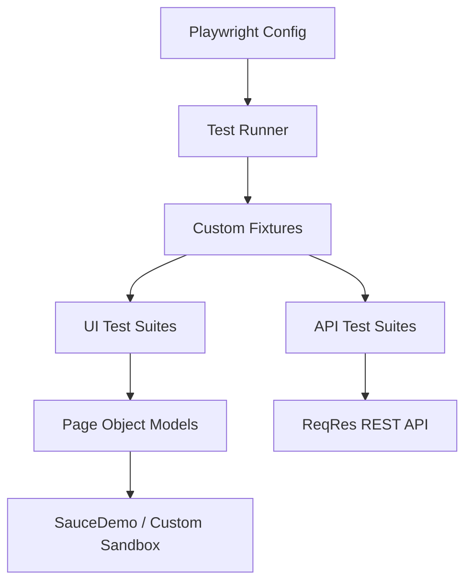
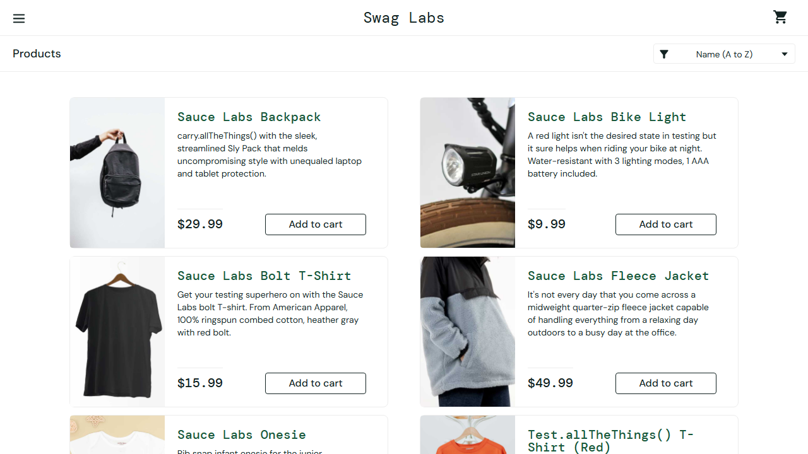
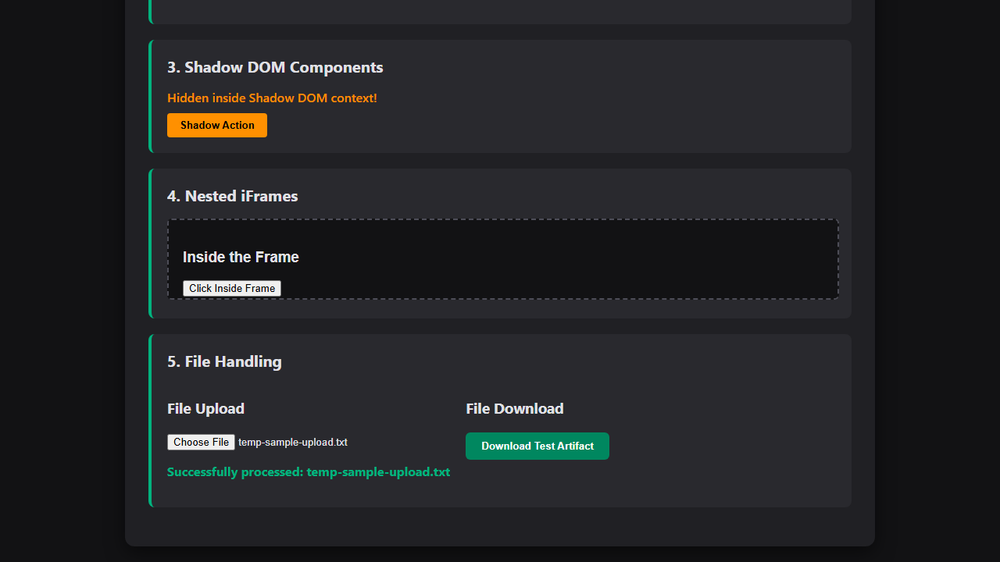

# 🎭 Playwright + TypeScript Enterprise Test Automation Showcase

[](https://www.typescriptlang.org/)
[](https://playwright.dev/)
[](https://github.com/features/actions)
[](https://opensource.org/licenses/MIT)

Welcome! This repository represents a **production-grade, standard-setting test automation framework** built using **Playwright** and **TypeScript**. 

It is specifically engineered to demonstrate modern SDET (Software Development Engineer in Test) design patterns, robust software architecture, offline reliability, CI/CD pipeline optimization, and clean-code philosophies to hiring managers and technical recruiters.

---

## 🏗️ Framework Architecture

This framework employs a **multi-layered, decoupled architecture** separating tests, element selectors, business actions, helper utilities, and configuration profiles.



### 🌟 Key Architectural Highlights
1. **Page Object Model (POM)**: Enforces DRY (Don't Repeat Yourself) principles. Page Locators and element interaction states are encapsulated inside dedicated classes extending a common abstract [BasePage.ts](src/pages/BasePage.ts).
2. **Custom Playwright Fixtures**: Implements dynamic instantiations of all POMs. Also provides a custom `loggedInPage` fixture that handles authentication state generation, eliminating standard login boilerplate code across user journey tests.
3. **Playground Sandbox Stability**: To prevent E2E failures due to flakey public testing sites, the repository includes a custom [playground.html](src/tests/ui/playground.html) loaded natively as a file URL, showcasing complex interactions (iframes, file transfers, shadow DOM, alert intercepts) offline with 100% stability.
4. **Decoupled Configuration**: Supports `.env` profile loading using `dotenv` to toggle environments (Dev, Staging, Prod) and credential storage cleanly.

---

## 🛠️ Tech Stack & Dependencies

- **Core**: [Playwright](https://playwright.dev/) (v1.43+) E2E Test runner.
- **Language**: [TypeScript](https://www.typescriptlang.org/) (v5.4+) with strict type compilation checks.
- **Environments**: [dotenv](https://www.npmjs.com/package/dotenv) configuration.
- **CI/CD**: [GitHub Actions](https://github.com/features/actions) YAML pipeline with optimized browser caching.

---

## 🚀 Getting Started & Local Setup

### 1. Prerequisites
Ensure you have **Node.js (version 18 or 20+)** installed on your operating system.

### 2. Clone and Install Dependencies
```bash
# Clone the repository
git clone https://github.com/<your-username>/playwright-typescript-portfolio.git
cd playwright-typescript-portfolio

# Install NPM packages
npm install
```

### 3. Install Playwright Browsers
```bash
# Downloads Chrome, Firefox, and WebKit (Safari) binaries along with dependencies
npx playwright install --with-deps
```

### 4. Configure Environment Variables
Copy `.env.example` to `.env` and fill in credentials:
```bash
cp .env.example .env
```

---

## 💻 Running the Test Suites

This project features convenient package scripts defined inside `package.json`:

| Command | Description |
|---------|-------------|
| `npm run test` | Executes **all** UI and API tests headlessly in parallel across all browsers. |
| `npm run test:ui` | Runs only UI test suites against the standard Chromium project. |
| `npm run test:api` | Runs API contract and integration tests using Playwright's `request` context. |
| `npm run test:ui-mode` | Launches Playwright's interactive **UI Mode** (great for visual debugging and time-travel tracing). |
| `npm run test:debug` | Launches Playwright Inspector for step-by-step code line executions. |
| `npm run test:report` | Serves the generated local HTML execution report on localhost. |
| `npm run lint` | Runs ESLint and TypeScript compiler type-check (`tsc --noEmit`). |

---

## 🔬 Showcase Highlights: Recruiter Questions answered

### How do you handle element locator flakiness?
We avoid brittle CSS paths and absolute XPaths. Playwright’s user-centric locators are utilized (`page.getByPlaceholder`, `page.getByRole`, etc.), making our automation mimics actual user eyes and improving code resilience to DOM structure refactors.

### How do you handle asynchronous waiting states?
**Zero hard sleep statements (`page.waitForTimeout`) are used in this codebase.** Hardcoding sleep times is a major SDET anti-pattern that slows pipelines down and leads to flaky builds. We leverage:
- Playwright's native **auto-waiting** actions.
- Explicit smart waits on locators (`locator.waitFor({ state: 'visible' })`).
- Multi-polling assertions (`await expect(locator).toBeVisible({ timeout: 5000 })`).

### What advanced interactions are covered?
Inside the [advanced-elements.spec.ts](src/tests/ui/advanced-elements.spec.ts) suite:
- **Shadow DOM**: Uses Playwright's shadow-piercing locators to access encapsulated widgets.
- **iFrames**: Manages nested contexts cleanly via `page.frameLocator()`.
- **Dialogs**: Registers `dialog` event handlers to intercept, validate, and click JS `confirm()` boxes.
- **File Transfers**: Uploads physical file paths and streams downloads directly to validating streams.

### How is REST API contract testing handled?
Inside [api-contract.spec.ts](src/tests/api/api-contract.spec.ts), we validate ReqRes endpoints:
- Operates GET, POST, PUT, DELETE operations headlessly.
- Validates structural consistency by executing **TypeScript Type Guard schema contract checkers** to assert returned API keys match expected interfaces.

---

## 📊 Live E2E Test Execution Reports

To showcase automated verification consistency, below are live execution captures captured during headless execution on the Chromium browser:

### 🛍️ E2E Buyer Journey Checkout Test
Our automated buyer flow logs in, aggregates products to the cart, validates intermediate sum calculation details, and executes order transactions successfully.



### 🔬 Advanced Sandboxed Interactions Test
Our custom, offline-ready HTML sandbox verification suite intercepts dialogues, parses shadow-DOM elements, uploads test buffers, and downloads files.



---

## 🎡 Continuous Integration (CI/CD)

The project includes a robust GitHub Actions configuration at `.github/workflows/playwright-ci.yml`.

### CI Pipeline Steps:
1. **Code Checkout** and Node env setups.
2. **Dependency Caching**: Caches `npm` modules to speed up subsequent executions.
3. **Playwright Browser Cache**: Evaluates and caches Playwright binaries based on framework version hashes, slashing pipeline time by **over 3 minutes per run**!
4. **Lint and Compile checks**: Halts execution if static types fail or style guide violations are found.
5. **Execution**: Runs the entire parallelized suite headlessly.
6. **Artifact Packaging**: In case of a test failure, screenshots, network traces, console warnings, and video recordings are archived and uploaded as a download-ready pipeline artifact.

---

## 📝 Best Practices Checklist
- [x] **Page Object Model Pattern** for separation of concerns.
- [x] **No hardcoded sleeps (`sleep()`)** — reliance on smart wait states.
- [x] **Decoupled configs** (.env) avoiding hardcoded credentials.
- [x] **Strict TypeScript** compilation rules.
- [x] **Pre-authenticated fixtures** for optimized speed.
- [x] **REST API Schema Validation** matching JSON contracts.
- [x] **Enterprise CI Caching** for optimized running costs.
